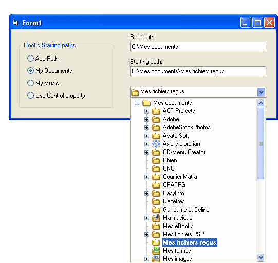



## ComboDir5

### Description

usercontrol combo drive with root and starting paths property, deal with invariant paths ie PIDL, UNC drives and folders, support xp theme etc.. their two versions of this control :one with properties pages etc, and an other all in one usercontrol.
 
### More Info
 
Vote isn't really important for me, I search a good job in France in Paris or Normandie (VB or .Net) so email me if you got one for me...

             |
---                |---
**Submitted On**   |2006-04-10 21:35:18
**By**             |[Thierry Calu](https://github.com/Planet-Source-Code/PSCIndex/blob/master/ByAuthor/thierry-calu.md)
**Level**          |Advanced
**User Rating**    |4.9 (39 globes from 8 users)
**Compatibility**  |VB 6\.0
**Category**       |[OLE/ COM/ DCOM/ Active\-X](https://github.com/Planet-Source-Code/PSCIndex/blob/master/ByCategory/ole-com-dcom-active-x__1-29.md)
**World**          |[Visual Basic](https://github.com/Planet-Source-Code/PSCIndex/blob/master/ByWorld/visual-basic.md)
**Archive File**   |[ComboDir51993695132006\.zip](https://github.com/Planet-Source-Code/thierry-calu-combodir5__1-65313/archive/master.zip)

